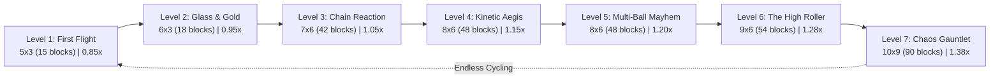

# BlockBreaker: Game Design Document (GDD)

**Version**: 2.0  
**Status**: Living Design Specification  
**Project**: BlockBreaker (`com.RaminRasulzade.BlockBreaker`)  
**Target Engine**: Unity 6 (6000.6.0f1) Universal Render Pipeline (URP)  
**Lead Designer / Architect**: Ramin Rasulzade & Antigravity  

---

## 1. Executive Summary & Vision

### 1.1 Game Concept
**BlockBreaker** is a modern 3D physics-driven arcade brick breaker built with cutting-edge Unity 6 architectural patterns. Blending tactile tactile arcade physics, fluid deflection control, explosive chain reactions, and vibrant Universal Render Pipeline visuals, BlockBreaker delivers an escalating, high-energy arcade journey across a progressive 7-level campaign arc.

### 1.2 Core Pillars
1. **Kinetic Control & Agency**: Deflection is entirely player-directed through continuous paddle contact geometry—no rigid RNG ricochets.
2. **Layered Chaos & Escalation**: Each level organically introduces new modifiers, armored durability, explosive area-of-effect hazards, and juggling mechanics.
3. **Pristine Cross-Platform Polish**: Designed from day one for seamless touch (iOS Dynamic Island / notch safe-area compliance) and desktop gameplay, zero-allocation rendering, and hitch-free Apple Metal / WebGPU execution.
4. **Resilient Arcade Sound**: A hybrid audio engine combining handcrafted sound effects with procedural synthesis fallbacks for 100% offline acoustic reliability.

---

## 2. Core Mechanics & Physics

### 2.1 Paddle Control & Deflection Physics
- **Dimensions**: Aspect ratio of 5:1 (default $5.0 \times 1.0 \times 1.0$ in 3D world units).
- **Initial Y-Position**: $Y = -6.5$.
- **Paddle Motion**:
  - Horizontal movement clamped dynamically to playfield boundaries:
    $$X_{\text{min}} = -10.0 + \frac{W}{2}, \quad X_{\text{max}} = 10.0 - \frac{W}{2}$$
  - Direct 1:1 mouse tracking, responsive touch dragging, or keyboard (`A`/`D`, `LeftArrow`/`RightArrow`) with smooth acceleration.
- **Dynamic Angle Deflection Formula**:
  When the ball strikes the paddle, the reflection vector is computed from the normalized contact offset:
  $$\text{normalizedOffset} = \frac{P_{\text{ball}.x} - P_{\text{paddle}.x}}{\frac{W_{\text{paddle}}}{2}} \quad \in [-1.0, 1.0]$$
  The resulting deflection angle $\theta$ (measured relative to the horizontal $+X$ axis) is:
  $$\theta = 90^\circ - (\text{normalizedOffset} \times 60^\circ)$$
  - Center hit ($\text{offset} = 0.0$): $\theta = 90^\circ$ (straight vertical).
  - Extreme left edge ($\text{offset} = -1.0$): $\theta = 150^\circ$ ($30^\circ$ upward-left).
  - Extreme right edge ($\text{offset} = 1.0$): $\theta = 30^\circ$ ($30^\circ$ upward-right).
  - **Guarantee**: Bounce angles are strictly bounded to $[30^\circ, 150^\circ]$, eliminating flat horizontal infinite traps.

### 2.2 Ball Launch & Movement
- **States**:
  - `ReadyToLaunch`: Ball is docked atop the paddle at $Y = P_{\text{paddle}.y} + 0.9$ with zero velocity. Clicking, tapping, or pressing `Space` launches the ball.
  - `InPlay`: Ball travels at a constant level-calibrated speed with frictionless restitution (`PM_ArcadeBounce.physicMaterial`).
- **Initial Launch Vector**: Directed upward-right at $+75^\circ$ ($\vec{v} = (\cos 75^\circ, \sin 75^\circ) \cdot \text{speed}$).

### 2.3 Arena Bounds & Frustum Math
- **Boundary Colliders**:
  - Top Wall: $Y = 24.25$
  - Left Wall: $X = -10.5$, Right Wall: $X = +10.5$ (wall height $32.0$)
  - Kill Zone: Trigger boundary at $Y = -9.0$
- **Dynamic Frustum Framing (`ResponsiveCameraController`)**:
  - Perspective camera with vertical field of view $\text{FOV}_v = 38^\circ$.
  - Dynamically calculates camera $Z$-distance to satisfy:
    $$Z_{\text{required}} = \max\left(\frac{H_{\text{arena}}}{2 \tan(\text{FOV}_v / 2)}, \frac{W_{\text{arena}}}{2 \tan(\text{FOV}_h / 2)}\right)$$
  - Guarantees 100% visible arena boundaries on any aspect ratio: 16:9 widescreen, 9:16 portrait mobile, 9:19.5 iPhone tall displays, or ultrawide.

### 2.4 Lives & Scoring Rules
- **Lives**:
  - Starting lives: **3**.
  - Maximum lives: **5** (attainable via `ExtraHeart` powerup).
  - Visualized on HUD as interactive heart icons (`TX_Heart_Fill.png` / `TX_Heart_Empty.png`).
- **Brick Tiers**:
  - **Red Brick**: Bottom tier, 10 base points.
  - **Green Brick**: Middle tier, 20 base points.
  - **Blue Brick**: Top tier, 30 base points.
- **Score Multipliers**:
  - Stacking with brick point values ($2\times \to 20, 40, 60$ pts; $3\times \to 30, 60, 90$ pts).
  - Level score carries forward cumulatively across levels and infinite cycle advancement.

---

## 3. Power-ups & Special Brick Archetypes

| Modifier | Visual Indicator | Archetype | Mechanic Description |
| :--- | :--- | :--- | :--- |
| **Paddle Expander** | Cyan particle aura | Power-up | Expands paddle width by $+10\%$ compounding ($W_n = W_{prev} \times 1.10$, clamped to max $12.0$). Recalculates boundary clamps instantly. Plays break + powerup audio. |
| **Score Multiplier 2X** | `2X` badge (`#FFD700` Gold) | Multiplier | Doubles brick point value (Red = 20, Green = 40, Blue = 60). |
| **Score Multiplier 3X** | `3X` badge (`#FF8C00` Amber) | Multiplier | Triples brick point value (Red = 30, Green = 60, Blue = 90). Premium modifier introduced in Level 6. |
| **Glass-Enclosed** | Translucent 1.18x outer shell | Armored Brick | Encased in a protective crystal shell (`MI_Block_Glass.mat`). Requires 2 hits: Hit 1 shatters glass shell with crystal debris; Hit 2 destroys base brick for $2\times$ base points. |
| **Bomb Brick** | `BOMB` badge (`#FF3B30` Crimson) | Area Hazard | Detonates in a $2.5$-unit radius upon impact, triggering cascading destruction of adjacent bricks with outward physical debris impulses. Protected against recursion by `isDestroyed` flag. |
| **Shield** | `SHIELD` badge (`#00E5FF` Cyan) | Defensive Power-up | Activates a 10-second defensive safety net at the arena bottom. Any ball falling into the kill zone is safely intercepted and redocked onto the paddle in `ReadyToLaunch` without life deduction. Displays live HUD countdown. |
| **Multi-Ball** | `3-BALL` badge (`#E040FB` Purple) | Kinetic Power-up | Spawns 2 extra balls at $\pm 35^\circ$ diverging angles from the trigger point (3 active balls simultaneously). Extra balls falling do NOT penalize lives; life loss only triggers when the final remaining ball falls. |
| **Extra Heart** | `+1 HP` badge (`#FF2D55` Pink) | Recovery Power-up | Grants $+1$ life up to the hard cap of 5. Plays flying heart parabolic HUD animation. |

### 3.1 World-Space UI Badges (`BlockBadge.cs`)
- Rendered via Unity 6 `PanelRenderer` in `WorldSpace` mode (`80px` fixed dimension, 100 PPU, clamped layout margins).
- Renders badges cleanly without billboard artifacts or depth sorting flickering.

---

## 4. Progressive 7-Level Campaign Arc

Levels scale smoothly in grid size, ball velocity, modifier density, and structural layout. Upon completing Level 7, the game smoothly cycles back to Level 1 ($7 \to 1$) preserving cumulative high scores and player lives.

### Level-by-Level Specification

| Level | Name | Theme & Star Mechanic | Cols $\times$ Rows | Blocks | Speed | Modifiers Breakdown |
| :---: | :--- | :--- | :---: | :---: | :---: | :--- |
| **1** | **First Flight** | **Warmup & Deflection Mastery** | $5 \times 3$ | **15** | `0.85x` (Paddle 5.5) | • 1x Paddle Expander • *0x Hazards / Armored Bricks* |
| **2** | **Glass & Gold** | **Durability & High Scores** | $6 \times 3$ | **18** | `0.95x` (Paddle 5.0) | • 1x 2X Multiplier, 2x Glass-Enclosed, 1x Expander |
| **3** | **Chain Reaction** | **Explosive Cascades** | $7 \times 6$ | **42** | `1.05x` (Paddle 5.0) | • 2x Bombs, 2x 2X Multipliers, 1x Expander (`Checkerboard`) |
| **4** | **Kinetic Aegis** | **Speed Surge & Protective Net** | $8 \times 6$ | **48** | `1.15x` (Paddle 5.0) | • 1x Shield, 1x Extra Heart, 1x Bomb, 2x Glass, 1x 2X |
| **5** | **Multi-Ball Mayhem** | **Ball Juggling Rush** | $8 \times 6$ | **48** | `1.20x` (Paddle 5.0) | • 2x Multi-Ball, 1x Shield, 1x Bomb, 2x Glass, 1x 2X (`Checkerboard`) |
| **6** | **The High Roller** | **High Stakes & 3X Multiplier** | $9 \times 6$ | **54** | `1.28x` (Paddle 5.0) | • 1x 3X (90 pts on Blue!), 2x 2X, 1x Heart, 1x Shield, 1x Multi-Ball, 2x Bombs, 3x Glass |
| **7** | **Chaos Gauntlet** | **The Grand Climax** | $10 \times 9$ | **90** | `1.38x` (Paddle 5.0) | • 2x 3X, 2x 2X, 2x Expanders, 3x Bombs, 4x Glass, 1x Heart, 2x Shields, 2x Multi-Balls (`Randomized`) |

- **Asset Storage**: Serialized as ScriptableObjects `Assets/Settings/Levels/SO_Level_01.asset` through `SO_Level_07.asset`.
- **Runtime Generation**: `LevelGenerator.cs` instantiates tiered rows with alternating or randomized palettes and dynamically attaches special modifier components (`PaddleExpander`, `ScoreMultiplier`, `BombBlock`, `GlassEnclosed`, `PowerupShield`, `PowerupMultiBall`, `PowerupExtraHeart`).

---

## 5. UI / UX Architecture

### 5.1 Technology: UI Toolkit & PanelRenderer
- Built natively using Unity 6 UI Toolkit with `PanelRenderer` components on `UI_HUD` and `UI_MainMenu`.
- Runtime styling via modern CSS-like Flexbox (`MainMenuUI.uss`, `BlockBreakerHUD.uss`).
- Zero-garbage runtime label updates via direct text assignment and string formatting.

### 5.2 Responsive Layout & Safe Area Controller
- **`SafeAreaController.cs`**:
  - Dynamically queries `Screen.safeArea` in screen coordinates.
  - Converts pixel insets to UI Toolkit percentage or pixel offsets applied to child roots (`hud-root`, `root-container`).
  - Clears hardware obstructions (iPhone notches, Dynamic Island, rounded corners, Android navigation bars).

### 5.3 HUD & Navigation Elements
1. **Top Bar**:
   - Current Level Title & Star Mechanic indicator.
   - Cumulative Score counter with pulse animation on increment.
   - 5-slot Heart Life Gauge.
   - Shield Active countdown timer (displays remaining seconds when active).
2. **Quick Action Bar**:
   - **Pause / Resume**: Dynamic icon swapping between pause bars and play triangle.
   - **Settings Toggle**: Opens tuning modal with a 360° compounding mechanical spin transition.
   - **Audio Mute / Unmute**: Live volume state toggle with custom speaker icons.
3. **Level Selection Matrix**:
   - Responsive 2-row wrapped flex container:
     - Top row: `LVL 1` through `LVL 4`
     - Bottom row: `LVL 5` through `LVL 7`
   - Touch targets $> 80\text{px}$ adhering to Apple Human Interface Guidelines and Google Material Design.
4. **Interactive Level Settings Modal**:
   - Live runtime tuning sliders:
     - **Ball Speed**: $0.5\times$ to $2.5\times$
     - **Paddle Speed**: $10.0$ to $40.0$
     - **Block Rows**: $1$ to $9$
   - Instant visual reflection in playfield.

---

## 6. Graphics, VFX & Performance Engineering

### 6.1 Universal Render Pipeline (URP) Setup
- **Master Materials (`MT_`)**: Base PBR materials (`MT_Master_PBR_URP.mat`) using `Universal Render Pipeline/Lit`.
- **Material Instances (`MI_`)**: Material variants inheriting from master (`MI_Paddle`, `MI_Ball`, `MI_Block_Red`, `MI_Block_Green`, `MI_Block_Blue`, `MI_Block_Glass`, `MI_Playfield_Border`).
- **Lighting & Ambiance**:
  - Skybox removed; camera clears to dark arcade studio tint (`#14141F`).
  - Warm directional key light (`RGB: 1.0, 0.88, 0.45`, intensity `1.6`) + cool fill light (`RGB: 0.35, 0.65, 1.0`, intensity `0.8`).
  - Global Volume post-processing: Bloom (scatter `0.7`, intensity `1.2`, threshold `0.85`), Tonemapping, Vignette.

### 6.2 Frame-0 Shader Prewarming (`BlockVFXManager.cs`)
- **Problem**: First brick collision on GPU drivers (Apple Metal, WebGPU, Vulkan, DX12) often causes micro-stutter due to just-in-time shader compilation.
- **Solution**:
  - Dispatches off-camera simulation cycles during `Start()` while the player is in `ReadyToLaunch`.
  - Warms both raster pipeline state objects (PSOs) and compute shaders upfront.
  - Zero-allocation `MaterialPropertyBlock` color tinting preserves 100% SRP Batcher compatibility without material cloning.
  - Struct-based simulation lists (`ActiveDebris`, `ActiveVFX`) eliminate per-brick coroutine allocations.

### 6.3 Apple Metal Custom Debris Shader
- Custom URP shader `Assets/Shaders/VFX_BlockDebris.shader` (`Arcade/VFX_BlockDebris`) ensures 100% shader compilation compatibility on iOS Metal without fallback to uncompiled magenta.

---

## 7. Audio Architecture

### 7.1 Hybrid Sound Engine (`ArcadeAudioManager.cs`)
- Persistent singleton across scene transitions (`DontDestroyOnLoad`).
- **Dedicated Sound Effects (`AU_`)**:
  - `AU_Pop.mp3`: Ball-paddle deflection and boundary bounce.
  - `AU_Break.mp3`: Standard brick shatter.
  - `AU_Powerup.mp3`: Multi-Ball & Paddle Expander pickup.
  - `AU_Powerup_Shield.mp3`: Shield activation and bottom interception.
  - `AU_Life_Lost.mp3`: Ball falling past paddle into killzone.
  - `AU_Level_Success.mp3`: Level completion fanfare.
  - `AU_Game_Over.mp3`: Zero lives exhaustion jingle.
  - `AU_Button_Press.mp3`: UI button tactile click.
- **Procedural Synthesizer Fallback**:
  - Generates real-time math-based audio waveforms (sine, triangle, white noise envelopes) if audio files are missing or unassigned, ensuring acoustic feedback is never silent.

---

## 8. Cross-Platform Build Architecture

### 8.1 Targets & Pipelines
- **iOS & macOS (Apple Silicon)**:
  - Swift Xcode Project: `PlayerSettings.xcodeProjectType = XcodeProjectType.Swift`.
  - Modern Swift lifecycle (`MainApp.swift`).
  - Native safe area resolution.
- **WebGPU / WebGL**:
  - Primary web graphics target configured for modern browsers with WebGPU fallback to WebGL 2.0.
- **Standalone PC / Mac**:
  - High frame-rate desktop build with full keyboard, mouse, and game controller input mapping.

---

## 9. Quality Assurance & Automated Verification

### 9.1 Test Suite Architecture (`Assets/Tests/BlockBreakerCoreTests.cs`)
- **Engine**: NUnit test framework within `Arcade.Tests` assembly.
- **Total Tests**: **79 passing tests (100%)**.
- **Execution Time**: ~130 milliseconds.
- **Test Coverage**:
  1. Score calculation, multipliers ($2\times$, $3\times$), and tier values.
  2. Dynamic paddle deflection angles across full offset spectrum $[-1.0, 1.0]$.
  3. Boundary clamping with compounding paddle widths up to $12.0$.
  4. Life tracking, death thresholds, and Extra Heart capping at $5$.
  5. Responsive camera frustum math across multiple aspect ratios ($16:9$, $9:16$, $9:19.5$).
  6. Safe area inset propagation to UI Toolkit hierarchy.
  7. Bomb brick detonation radius and non-recursive explosion flags.
  8. Glass-enclosed brick 2-hit durability and shell shatter.
  9. Shield 10-second timer decrement and kill zone safe interception.
  10. Multi-ball concurrent ball management and tolerant life loss.
  11. Complete 7-level campaign arc validation, parameter monotonicity, and endless loop wrap-around.
